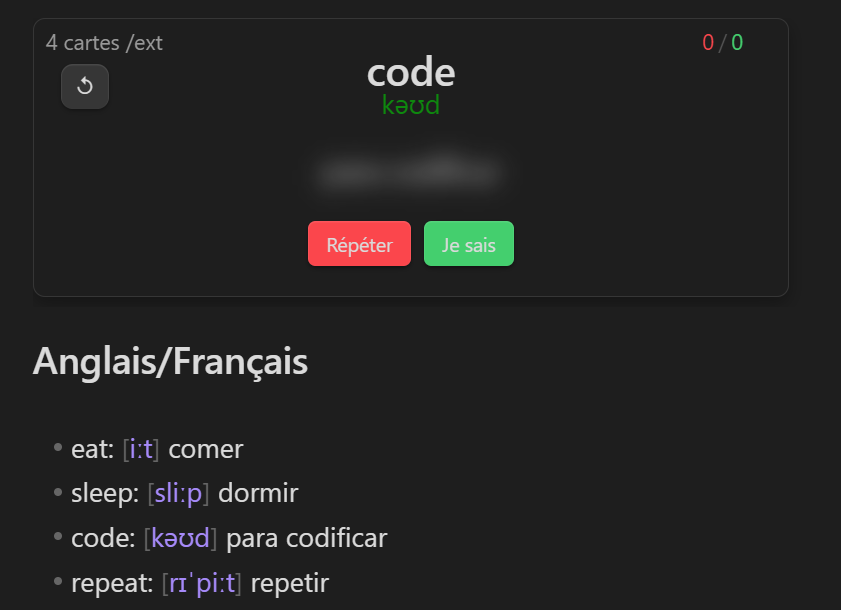

# UNDER CONSTRUCTION  
  
## Vocabulary cards

from [cards](https://github.com/meniam/obsidian-vocabulary-cards) 
Plugin fixé.  under  construc   ... 



### New features:  

- Cards appear with a weighted frequency, favoring those with more errors for targeted learning.

- empty codeblock:
  ````
  ```voc-card  |     ```voca-card
               or    ```
  ```          |
  ````
  If the source code block is empty, the code block is populated by the markdown page content(except code blocks). Use `[...]` for **transcription** instead of `<...>`   
  
- The ↺ button is used to synchronize the code block after editing the markdown page. 

- caution : if you do a copy past of an existing code block,  delete the id in the new one. Else you are saving stats as one code block.

## Development (Add this to your README)

### Optional (SASS):
If you add a `styles.scss` file to the `src` folder, it will automatically be converted to CSS when you run commands such as `npm run dev`.

### Environment Setup

- **Development in the plugins folder of your vault:**
  - Set the `REAL` variable to `-1` in the `.env` file. This indicates that you are developing your plugin directly in the plugins folder of your vault.

- **Development outside the vault:**
  - If your plugin's source code is outside the vault, set the `REAL` variable to `0` in the `.env` file. In this case, the necessary files, including `main.js`, will be automatically copied to the vault during development. During the build process, the JS and CSS files will be generated in the folder containing your source code. You can then push to GitHub and create a release directly from this folder using the commands listed below.

### Managing Vaults (IMPORTANT)

- Two vault paths are defined in the `.env` file:
  1. One for your **development vault** to protect your main vault.
  2. One for your **main vault**, where you can perform a real installation.

- Depending on the command executed, the `REAL` variable will take a different value and adapt to the corresponding path.

### Available Commands

- **`npm run dev` and `npm start`**: Used for development in your development vault. `npm start` opens Visual Studio Code, runs `npm install`, and then `npm run dev`, allowing for a quick start from the folder containing the source code.

- **`npm run build`**: Builds the project in the folder containing the source code.

- **`npm run real`**: Equivalent to a traditional installation of the plugin in your main vault. Note: `main.js` is generated via a build.

- **`npm run bacp`**: After development and before creating a release. `b` stands for build, and `acp` stands for add, commit, push. You will be prompted for the commit message.

- **`npm run acp`**: Performs add, commit, push without going through the build step.

- **`npm run version`**: Asks for the type of version update, modifies the relevant files, and then performs an add, commit, push. It makes sense to run this after `bacp`.

- **`npm run release`**: Asks for the release title and creates the release. This command works with the configurations in the `.github` folder. The title can be multiline by using `\n`.